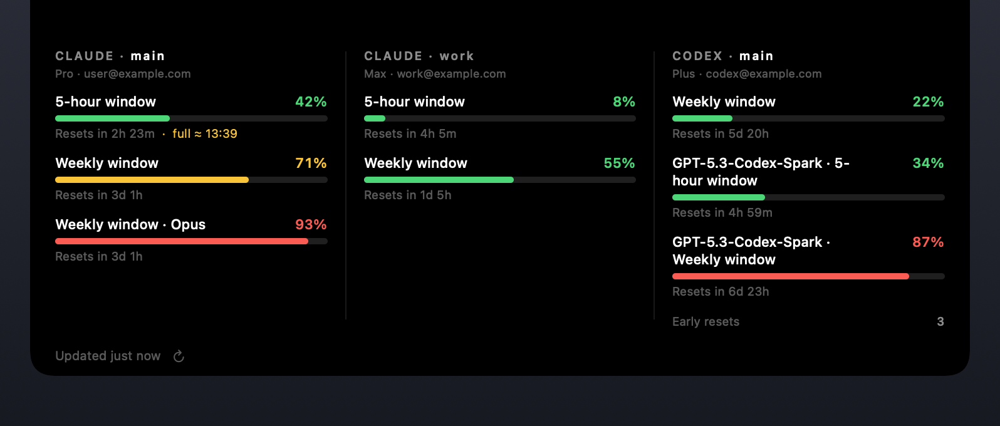
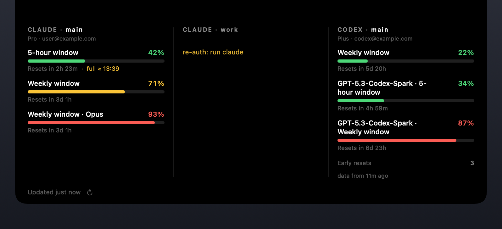

# NotchLimits

[English](README.md) · **Русский**

Панель, выезжающая из челки MacBook, с лимитами **Claude Code** и **Codex** (OpenAI). Нативное macOS-приложение на Swift/SwiftUI, собирается одним скриптом, без Xcode-проекта.



## Что умеет

- Колонка на каждый аккаунт — все профили Claude и Codex сразу.
- Набор окон лимитов не зашит в код: рисуется всё, что вернул API, включая окна, которых не было вчера.
- Живёт в челке: свёрнутая панель совпадает с вырезом пиксель в пиксель и не видна.
- Работает и без челки (внешний монитор, Mac mini, iMac).
- Уведомления при пересечении 80 % и 95 % по любому окну и когда заметно израсходованное окно сбрасывается и освобождается.
- Переживает перезапуск: последние проценты кэшируются и показываются с пометкой возраста.
- Ошибка или лимит одного аккаунта не трогает остальные колонки.
- Интерфейс на 14 языках, выбирается по языку системы.
- Длинные названия окон переносятся, а не режутся, — панель подрастает под них.

## Требования

- macOS 13 и новее
- Swift 5.9 и новее (Xcode Command Line Tools)
- `claude` и/или `codex` CLI с выполненным входом

## Сборка и запуск

```bash
./build.sh && open build/NotchLimits.app
```

`build.sh` делает `swift build -c release`, собирает `build/NotchLimits.app` с `Info.plist` (`LSUIElement = true`, `CFBundleIdentifier = com.ziqq.notchlimits`) и подписывает бандл. Приложение фоновое — иконки в доке и меню-баре нет; выход через контекстное меню панели.

Перезапуск после пересборки:

```bash
pkill -x NotchLimits; open build/NotchLimits.app
```

## Как пользоваться

| Действие | Что происходит |
| --- | --- |
| Навести курсор на челку | Панель раскрывается |
| Увести курсор | Закрывается через 0,1 с |
| Клик по панели | Закрепить раскрытой |
| Повторный клик, клик мимо, **Esc** | Закрыть |
| **⌘P** (настраивается) | Открыть/закрыть из любого приложения |
| Правый клик | Контекстное меню |

На экране без челки панель живёт в верхнем центре; в свёрнутом виде — маленькая пилюля с точкой на каждый аккаунт, цвет точки показывает самое загруженное окно:


Контекстное меню: **Обновить** (принудительный опрос, минуя таймеры и бэкофф), **Добавить аккаунт Claude / Codex…**, подменю **Скрыть** / **Переименовать колонку**, **Показать скрытые колонки**, подменю **Горячая клавиша**, **Запуск при входе** (`SMAppService`) и **Выход**.

## Имена колонок

Основной профиль обоих провайдеров подписан `main`, чтобы заголовки не расходились на «CLAUDE · main» и «CODEX · default». Дополнительные профили берут имя папки. Переименовать любую колонку — правый клик → **Переименовать колонку**; пустое поле возвращает имя профиля. Имя хранится в `UserDefaults` отдельно от идентификатора колонки, поэтому переименование не роняет кэш и уведомления.

## Горячая клавиша

По умолчанию — **⌘P**. Это глобальный хоткей, поэтому пока NotchLimits запущен, он перехватывает «Печать» в других приложениях — и настраивается: правый клик → **Горячая клавиша**:

- **Изменить…** ловит следующее нажатие. Нужен хотя бы один модификатор ⌘, ⌥ или ⌃, иначе глобальный хоткей перехватывал бы обычный ввод.
- **Стандартная (⌘P)** / **Выключить** (оставить только наведение и клик).

Привязка идёт к физическому коду клавиши, раскладка на неё не влияет. Если сочетание занято, панель скажет об этом и оставит прежнюю настройку.

## Языки

14 языков: английский, русский, украинский, немецкий, французский, испанский, португальский (Бразилия), итальянский, польский, турецкий, японский, корейский, китайский упрощённый и традиционный. Выбирается по списку предпочитаемых языков системы; запасной — английский. Только LTR: макет не зеркалится, поэтому иврит и арабский намеренно не добавлены.

Проверить любой язык, не меняя системные настройки:

```bash
./build/NotchLimits.app/Contents/MacOS/NotchLimits -AppleLanguages "(ja)"
```

Единственный источник правды по переводам — `Tools/make-strings.py`; он раскладывает их по `Resources/<язык>.lproj/Localizable.strings` и падает, если ключ забыт или лишний. Времена и знак процента тоже локализованы: `42 %` во французском, `42%` в японском, `%42` в турецком.

## Размеры панели

Ширина — 250 pt на колонку, но не меньше 500 pt и не шире экрана минус 40 pt. Высота подстраивается под содержимое: названия вроде «GPT-5.3-Codex-Spark · Недельное окно» переносятся, а не режутся, — вёрстка сообщает реальную высоту, и окно меняет размер под неё, в пределах 252–560 pt.

## Состояния колонок



- **Свежие данные** — прогресс-бар и время до сброса. Зелёный до 60 %, жёлтый 60–85 %, красный выше.
- **`re-auth: запусти claude` / `codex`** — токена нет, протух или пришёл 401. Панель не обновляет токены сама, этим занимается CLI.
- **`данные N мин назад`** — серая пометка: свежего ответа нет (лимит, сеть, только что запустились), показаны последние значения.
- **`обновляю…`** — данных ещё не было.

Сообщение про re-auth или ошибку показывается **поверх** кэшированных цифр, а не вместо них: иначе протухший токен выглядит просто как старые проценты и непонятно, что надо перелогиниться.

Под окнами перечисляются дополнительные цифры, если эндпоинт их отдал: баланс кредитов, доступные досрочные сбросы, расход сверх плана. Строки с нулём или без значения не показываются.

## Несколько аккаунтов

Меню → **«Добавить аккаунт Claude…»** или **«Добавить аккаунт Codex…»**. Диалог просит короткое имя профиля и сразу показывает результат (`Папка: ~/.claude-profiles/work`); кнопка «Создать» неактивна, пока имя не годится. Панель создаст `~/.claude-profiles/<имя>` (или `~/.codex-profiles/<имя>`), положит туда `login.command` и откроет его в Terminal.app. Пароли панель не спрашивает и не видит — вход делает CLI. Новые профили подхватываются автоматически, без перезапуска.

То же руками:

```bash
CLAUDE_CONFIG_DIR=~/.claude-profiles/work claude
CODEX_HOME=~/.codex-profiles/work codex login
```

Бинарники ищутся не по `PATH` (у GUI-приложения он почти пустой), а по известным местам: `~/.local/bin`, `~/.claude/local`, `/opt/homebrew/bin`, `/usr/local/bin`, расширение VS Code `anthropic.claude-code-*` и `/Applications/ChatGPT.app` для `codex`.

## Источники данных

**Claude Code.** Токен читается из Keychain (generic password, служба `Claude Code-credentials`; дополнительные профили — `Claude Code-credentials-<hash>`, где hash — sha256 от `CLAUDE_CONFIG_DIR`).

```
GET https://api.anthropic.com/api/oauth/usage
Authorization: Bearer <accessToken>
anthropic-beta: oauth-2025-04-20
User-Agent: claude-code/<версия установленного CLI>
```

Родной `User-Agent` важен — без него эндпоинт заметно чаще отвечает 429. Любое поле-объект с числовым `utilization` считается окном (`extra_usage` игнорируется), поэтому новые окна появляются сами, включая внутренние кодовые имена моделей вроде `nimbus_quill`. Названия: `five_hour`/`seven_day` — понятные подписи; известные префиксы разворачиваются (`seven_day_opus` → «Недельное окно · Opus»); остальное показывается словами, а не сырым snake_case. Подзаголовок — план (`Pro`, `Max`) из записи Keychain: почты Anthropic нигде не отдаёт. `extra_usage` не окно (это расход, а не доля квоты), поэтому уходит в строку статистики.

**Codex.** Авторизация из `~/.codex/auth.json` (или `$CODEX_HOME/auth.json`); режим `apikey` до usage-эндпоинта не дотягивается — нужен вход через ChatGPT. Срок жизни токена — из claim `exp` в JWT, e-mail для подписи колонки — из `id_token`.

```
GET https://chatgpt.com/backend-api/wham/usage
Authorization: Bearer <access_token>
ChatGPT-Account-ID: <account_id>
User-Agent: codex_cli_rs/<версия>
```

Рисуются `rate_limit.primary_window`, `secondary_window` и все `additional_rate_limits[]` — последние с префиксом из `limit_name` либо `metered_feature`. Название окна выводится из `limit_window_seconds`. Подзаголовок — `plan_type · почта`; `credits.balance` и `rate_limit_reset_credits.available_count` становятся строками статистики.

## Обновление и устойчивость

- Каждый аккаунт опрашивается независимо раз в 3 минуты, со сдвигом 4 с — не залпом.
- При раскрытии панели обновляются только колонки старше двух минут.
- Таймаут запроса 10 с, один ретрай на 5xx и сетевую ошибку.
- **HTTP 429 не ошибка.** Пауза берётся из `Retry-After`, иначе растёт 2 → 4 → 8 → 15 минут; в колонке остаются последние данные с пометкой возраста.
- Последние успешные значения кэшируются в `UserDefaults` и показываются сразу после перезапуска.
- Уведомление о пороге срабатывает один раз за окно и перевзводится, когда меняется `resets_at` (началось новое окно). Когда окно, дошедшее до ≥ 50 %, сбрасывается, приходит пуш «лимит сброшен» — был затык, стало свободно.

## Разрешения

- **Keychain.** При первом обновлении Claude macOS спросит доступ к `Claude Code-credentials` — нажми **«Разрешать всегда»**. Токен кэшируется в памяти до `expiresAt` или до 401, так что Keychain не дёргается на каждом цикле.
- **Подпись.** С сертификатом «Apple Development» `build.sh` подписывает им, и разрешение Keychain переживает пересборки. Без него подпись ad-hoc — хэш кода меняется каждую сборку, поэтому **Keychain будет заново спрашивать доступ после каждой пересборки**. Скрипт предупреждает об этом.
- **Уведомления.** Запрашиваются при первом запуске.
- **Accessibility не нужен** — хоткей на Carbon `RegisterEventHotKey`, а вход запускается `.command`-файлом, а не AppleScript.

## Приватность

Единственные сетевые запросы приложения — два официальных usage-эндпоинта выше. Больше никуда оно не ходит. Токены живут только в памяти: не логируются, не пишутся на диск, не попадают в кэш. На диск идут только настройки и последние проценты со временем сброса — в `UserDefaults`, без единого токена. `URLSession` работает в ephemeral-режиме, без кук и дискового кэша.

## CI и релизы

[`.github/workflows/ci.yml`](.github/workflows/ci.yml) — на каждый push в `main`, каждый PR и по кнопке: генерация переводов и проверка, что `Resources/*.lproj` не разошлись, `plutil -lint` строк, проверка генератора иконки (валидный `.icns`), `./build.sh`, самопроверка и проверки бандла (`Info.plist`, подпись, `LSUIElement`, иконка, все 14 локализаций), затем загрузка `.app` артефактом.

Самопроверка (`NOTCHLIMITS_SELFTEST=1`) не требует ни сети, ни Keychain, ни оконного сервера и покрывает разбор ответов Claude/Codex (мусор, `null`-окна, неизвестные ключи), порядок и названия окон, claims JWT, форматирование времени/возраста/процентов, сериализацию кэша и хоткея, полноту локализаций — одинаковый набор ключей, отсутствие пустых значений и **совпадение спецификаторов формата с английским**, иначе `String(format:)` уронил бы приложение на чужом языке.

[`.github/workflows/release.yml`](.github/workflows/release.yml) — по тегу `v*` или вручную с версией: собирает, гоняет самопроверку, сверяет версию в `Info.plist` с тегом, пакует через `ditto` (обычный `zip` портит подпись), считает SHA-256 и публикует релиз с `.zip` и `SHA256SUMS.txt`. Заметки к релизу собираются автоматически: установка (включая обязательное снятие карантина для ad-hoc), коммиты с прошлого тега, таблица состава и контрольная сумма.

Версия берётся из `NOTCHLIMITS_VERSION`, иначе из файла [`VERSION`](VERSION):

```bash
NOTCHLIMITS_VERSION=1.2.0 ./build.sh    # сборка
git tag v1.2.0 && git push origin v1.2.0    # релиз
```

## Отладочные режимы

Переменные окружения для запуска бинарника напрямую (`./build/NotchLimits.app/Contents/MacOS/NotchLimits`):

| Переменная | Что делает |
| --- | --- |
| `NOTCHLIMITS_PROBE=1` | Проверяет хоткеи и парсер Claude, опрашивает реальные аккаунты, печатает результат без GUI |
| `NOTCHLIMITS_RENDER=<папка>` | Рендерит `panel.png`, `states.png`, `collapsed.png` — картинки этого README |
| `NOTCHLIMITS_SNAPSHOT=<файл.png>` | Снимает реальное окно панели (не требует «Записи экрана») |
| `NOTCHLIMITS_MOCK=1` | Мок-данные вместо провайдеров |
| `NOTCHLIMITS_SELFTEST=1` | Оффлайн-самопроверка для CI, ненулевой код при провале |
| `-AppleLanguages "(ja)"` | Аргумент, не переменная: запуск на выбранном языке |

## Иконка

`Resources/AppIcon.icns` не хранится «как есть» — рисуется кодом:

```bash
swift Tools/make-icon.swift
```

Скрипт отрисовывает все десять размеров iconset и собирает `.icns` через `iconutil`, палитра полос та же, что в `Theme.swift`.

## Устройство

```
Sources/NotchLimits/
  App/        точка входа, делегат, контекстное меню, отладочные режимы
  Notch/      геометрия челки, NSPanel, hover-логика и анимации
  UI/         SwiftUI-вёрстка панели
  Model/      типы колонок и окон лимитов
  Providers/  Claude (Keychain + api.anthropic.com), Codex (auth.json + chatgpt.com)
  Core/       планировщик опроса, кэш, уведомления, хоткеи, добавление аккаунтов
Tools/
  make-strings.py   переводы для всех языков
  make-icon.swift   иконка приложения
```

Пара мест, где реализация неочевидна и менять её нужно осторожно:

- `NotchPanel.constrainFrameRect(_:to:)` возвращает рамку без изменений. Иначе AppKit сдвинет окно из-под меню-бара и панель перестанет прилипать к челке.
- Уровень окна — `.popUpMenu`, а не `.statusBar + 1`: на свежих macOS меню-бар рисуется выше, и панель оказалась бы под пунктами меню.
- `NotchHostingView.safeAreaInsets` занулён: окно само стоит поверх выреза, и добавочная safe area сдвинула бы содержимое ещё на высоту челки.
- При закрытии рамка окна ужимается на 0,35 с позже старта анимации, чтобы не срезать её последние кадры.
